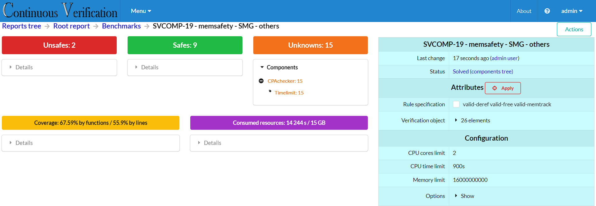

# Benchmark Visualizer

Benchmark Visualizer is a tool for visualizing benchmark verification results in [SV-COMP](https://sv-comp.sosy-lab.org) format.

## Deployment

1. [CVV web-interface](https://github.com/vmordan/cvv) should be deployed according to its instructions.

2. `Benchmark Visualizer` is installed with the following command:

```shell
make install-benchmark-visualizer DEPLOY_DIR=<deployment directory>
```

## Usage

It is supposed that the following parameters are known:
* `<host>` and `<port>` for web-interface server;
* `<user name>` and `<user password>` to access web-interface;
* `<deployment directory>` is a directory, in which `Benchmark Visualizer` was installed.

1. Create the following configuration file:
```json
{
  "uploader": {
    "upload results": true,
    "parent id": true,
    "identifier": "<parent report identifier>",
    "server": "<host>:<port>",
    "user": "<user name>",
    "password": "<user password>",
    "name": "<new report name>"
  },
  "Benchmark Launcher": {
    "output dir": "<absolute path to the directory with benchmark verification results>",
    "tasks dir": "<absolute path to the directory with source files>",
    "tool": "<tool name>"
  }
}
```
where 
- `<parent report identifier>` is name or id from reports tree (if the database is new and there is no 
reports tree, then you can use value `1` to make new report as a child of the root report),
- `<new report name>` is an arbitrary name, which will be used in the web-interface to distinguish the upload benchmark verification results from other results.

Here is an example of such configuration file:

```json
{
  "uploader": {
    "upload results": true,
    "parent id": true,
    "identifier": "SV-COMP",
    "server": "localhost:8989",
    "user": "uploader",
    "password": "uploader",
    "name": "CPAchecker, <rundefinition> config (<timestamp>)"
  },
  "Benchmark Launcher": {
    "output dir": "/home/cvuser/results/",
    "tasks dir": "/home/cvuser/sv-benchmarks/",
    "tool": "CPAchecker"
  }
}
```

2. Process already solved benchmark verification results from `<deployment directory>` with the command:

```bash
./scripts/process_benchmark.py --config <path to the configuration file>
```

If benchmark should be launched first, then use:

```bash
./scripts/process_benchmark.py --config <path to the configuration file> --launch
```

In case of successful uploading the following line should apper in the log:

```bash
ZIP archive with reports "..." was successfully uploaded on "<host>:<port>/jobs/<new report id>"
``` 

After that you can access uploaded results on the page `<host>:<port>/jobs/<new report id>`.

Some simple examples of benchmark verification results can be found in the `docs/examples/benchmarks` directory.

Example of benchmark visualization:

