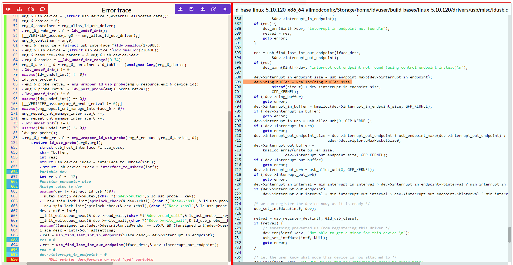

# Witness Visualizer

Witness Visualizer converts generic witnesses from [SV-COMP](https://sv-comp.sosy-lab.org) tools into user-friendly format.

## Requirements

Python (version>=3.6), python modules:
```shell
sudo pip3 install requests ujson graphviz ply pytest atomicwrites more-itertools pluggy py attrs setuptools six django psycopg2 pycparser sympy
```

## Deployment

In order to install `Witness Visualizer` in the `<deployment directory>` execute the following command:

```bash
make install-witness-visualizer DEPLOY_DIR=<deployment directory>
```

## Usage

After deployment Witness Visualizer can be used to visualise witnesses with command:

```
<deployment directory>/scripts/visualize_witnesses.py OPTIONS
```

Primary options:
* `-w` WITNESS, `--witness` WITNESS: path to the witness to be visualized;
* `-d` DIRECTORY, `--directory` DIRECTORY: directory with witnesses to be visualized (either `-w` or `-d` option must be specified);
* `-r` RESULT_DIR, `--result-dir` RESULT_DIR: directory, in which visualized witnesses will be placed in html format;
* `-s` SOURCE_DIR, `--source-dir` SOURCE_DIR: source files directory;
* `--dry-run`: do not visualize witnesses, only check their quality;
* `-u`, `--unzip`: unzip archives with visualized witnesses.

For example:

```bash
<deployment directory>/scripts/visualize_witnesses.py --witness output/witness.graphml --result-dir results/ --source-dir ~/sv-benchmarks
```

There are some examples of [SV-COMP](https://sv-comp.sosy-lab.org) witnesses in the `docs/examples/witnesses` directory,
which can be used to validate Witness Visualizer installation.

Example of violation witness visualization:

